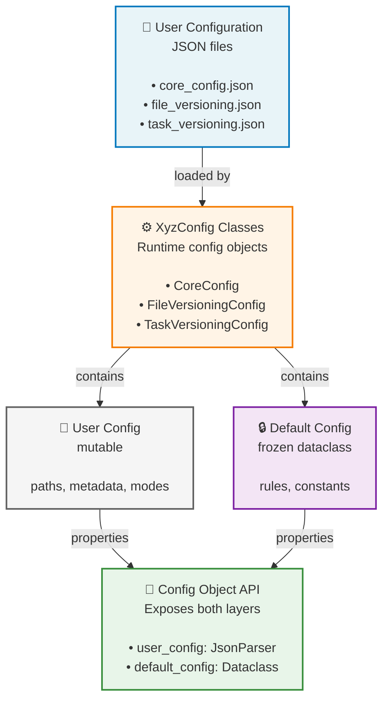

# Configuration Guide

VDD-A uses a **two-level configuration system** to separate what the user provides from what the code keeps as static defaults.

- **User config**: JSON input under `config/`, edited per document or environment.
- **Default config**: immutable Python dataclasses under `src/configs/default_config/`, used as versioned constants and parsing rules.

## Overview



## Why `Config` Matters

`Config` is the **base interface** that every feature-specific configuration class must extend. The user should not work directly with raw JSON files or with the default dataclasses in isolation: the child `Config` class is the public entry point that combines both sources and exposes a stable API.

In practice this means:

- the **user config** provides document-specific values such as paths, metadata, modes, and release-specific options;
- the **default config** provides static constants and rules such as allowed extensions, XML tags, INI field names, and exclusion lists;
- the concrete `XyzConfig` class exposes both layers through properties and convenience accessors.

For example, `CoreConfig`, `FileVersioningConfig`, and `TaskVersioningConfig` are the classes the rest of the codebase should use when it needs configuration.

## Layer 1: User Configuration (JSON Files)

**Location**: `config/` directory (at root level)

**Purpose**: User-provided input that varies per document/environment

**Characteristics**:
- Mutable (can be changed by editing JSON files)
- Environment-specific (paths, metadata, mode settings)
- Validates paths exist
- Provides document-specific parameters

### `core_config.json`

Core settings shared across all versioning operations.

```json
{
    "vdd_type": "vital",
    "input_mode": "localSource",
    "kernel_mode": "internal",
    "paths": {
        "stream_root": "C:\\path\\to\\source\\tree",
        "output_dir": "C:\\path\\to\\output",
        "rtc_cache_dir": "C:\\path\\to\\cache"
    },
    "metadata": {
        "doc_name": "VDD Document Title"
    }
}
```

<table>
  <thead>
    <tr>
      <th>Key</th>
      <th>Values</th>
      <th>Purpose</th>
    </tr>
  </thead>
  <tbody>
    <tr>
      <td><code>vdd_type</code></td>
      <td><code>"vital"</code> | <code>"non_vital"</code></td>
      <td>Document classification</td>
    </tr>
    <tr>
      <td><code>input_mode</code></td>
      <td><code>"localSource"</code></td>
      <td>How source data is provided (future: could be remote)</td>
    </tr>
    <tr>
      <td><code>kernel_mode</code></td>
      <td><code>"internal"</code> | <code>"external"</code></td>
      <td>Kernel architecture → affects task parsing paths</td>
    </tr>
    <tr>
      <td><code>paths.stream_root</code></td>
      <td>Absolute path</td>
      <td>Root of source tree to scan</td>
    </tr>
    <tr>
      <td><code>paths.output_dir</code></td>
      <td>Absolute path</td>
      <td>Where to write <code>.docx</code> output</td>
    </tr>
    <tr>
      <td><code>paths.rtc_cache_dir</code></td>
      <td>Absolute path</td>
      <td>Cache directory for optimizations</td>
    </tr>
    <tr>
      <td><code>metadata.doc_name</code></td>
      <td>String</td>
      <td>Human-readable document title</td>
    </tr>
  </tbody>
</table>

### `file_versioning.json`

Configuration for Chapter 2 (file versioning).

```json
{
    "mode": "version",
    "version_extraction_criteria": "Versione:\\s*(\\d+\\.\\d+)",
    "metadata": {
        "title": "LIST OF WSPHS+ SW FILES AND RELEVANT VERSIONS",
        "columns_name": ["Name", "Version"]
    }
}
```

<table>
  <thead>
    <tr>
      <th>Key</th>
      <th>Purpose</th>
    </tr>
  </thead>
  <tbody>
    <tr>
      <td><code>mode</code></td>
      <td>Version extraction method (<code>"version"</code> is the only supported mode)</td>
    </tr>
    <tr>
      <td><code>version_extraction_criteria</code></td>
      <td>Regex pattern to extract version from source code comments</td>
    </tr>
    <tr>
      <td><code>metadata.title</code></td>
      <td>Chapter title in the Word document</td>
    </tr>
    <tr>
      <td><code>metadata.columns_name</code></td>
      <td>Column header names in the output table</td>
    </tr>
  </tbody>
</table>

### `task_versioning.json`

Configuration for Chapter 3 (task versioning).

```json
{
    "previous_release": {
        "enabled": true,
        "root": "C:\\path\\to\\previous\\release",
        "version": "1.0"
    },
    "metadata": {
        "title": "TASK LIST",
        "columns_name": ["Name", "Type", "Version", "Modified"]
    },
    "app_tasks": ["ixl.ini", "srlw.ini"]
}
```

<table>
  <thead>
    <tr>
      <th>Key</th>
      <th>Purpose</th>
    </tr>
  </thead>
  <tbody>
    <tr>
      <td><code>previous_release.enabled</code></td>
      <td>Whether to compare against a baseline release</td>
    </tr>
    <tr>
      <td><code>previous_release.root</code></td>
      <td>Path to previous release stream root</td>
    </tr>
    <tr>
      <td><code>previous_release.version</code></td>
      <td>Version label for the baseline</td>
    </tr>
    <tr>
      <td><code>metadata.title</code></td>
      <td>Chapter title in the Word document</td>
    </tr>
    <tr>
      <td><code>metadata.columns_name</code></td>
      <td>Column header names (typically includes "Modified" status)</td>
    </tr>
    <tr>
      <td><code>app_tasks</code></td>
      <td>List of <code>.ini</code> files to parse for application tasks</td>
    </tr>
  </tbody>
</table>

---

## Layer 2: Default Configuration (Immutable Dataclasses)

**Location**: `src/configs/default_config/` directory

**Purpose**: Static structural constants and rules that never change at runtime

**Characteristics**:
- Immutable (`frozen=True` dataclasses)
- Code-based (defined in Python)
- Shared across all users
- Defines parsing rules, exclusion patterns, XML tag names, etc.

> **Deep Dive**: For a comprehensive guide on how default configs are structured, why dataclasses are used, and how to avoid verbosity, see [DEFAULT_CONFIG_ARCHITECTURE.md](src/configs/default_config/DEFAULT_CONFIG_ARCHITECTURE.md). Also check [USAGE_EXAMPLES.md](src/configs/default_config/USAGE_EXAMPLES.md) for practical code examples.

### Default Config Classes

#### `CoreDefaultConfig`

Static defaults for core document structure.

```python
@dataclass(frozen=True)
class CoreDefaultConfig:
    components: SoftwareComponents = field(default_factory=SoftwareComponents)
    serializer_config: SerializerConfig = field(default_factory=SerializerConfig)
    image_config_name: str = "Imgconf.ini"
```

- **SoftwareComponents**: Maps component names like `NSPC` (Safety Nucleus), `NS_KERNEL`, `SIMNS`, etc.
- **SerializerConfig**: Indentation style, encoding, XML declaration settings
- **image_config_name**: Standard INI filename for kernel configuration

#### `FileVersioningDefaultConfig`

Static rules for file versioning scanning.

```python
@dataclass(frozen=True)
class FileVersioningDefaultConfig:
    rules: Rules = field(default_factory=Rules)
    # rules contains:
    #   - inclusion.extensions: [".c", ".h", ".ads", ".adb", ".asm", ".s"]
    #   - exclusion.dirs: ["Protocols_win32", ".vscode", "BIN", ...]
    #   - exclusion.dirs_contains: [...]
    #   - exclusion.files: ["resource.h", "Loader.c", ...]
    tags: FileVersioningTag = field(default_factory=FileVersioningTag)
```

**Examples of static rules**:
- Allowed file extensions: `.c`, `.h`, `.ads`, `.adb`, `.asm`, `.s`
- Excluded directories: `BIN`, `OBJ`, `.vscode`, `MakeBatches`, etc.
- Path-based exclusions: "SONS-RTS" directory excludes `.ads`/`.adb` files
- XML output tag: `<file>`

#### `TaskVersioningDefaultConfig`

Static rules for task versioning and INI parsing.

```python
@dataclass(frozen=True)
class TaskVersioningDefaultConfig:
    roots: Roots = field(default_factory=Roots)
    sections: INISections = field(default_factory=INISections)
    app_task: AppTask = field(default_factory=AppTask)
    sys_task: SysTask = field(default_factory=SysTask)
    rules: Rules = field(default_factory=Rules)
    tags: TaskVersioningTag = field(default_factory=TaskVersioningTag)
    num_tasks: str = "NumTask"
```

**Static parsing constants**:
- **Roots**: Internal mode → `NSPC`, External mode → `NSPC` + `NS_KERNEL`
- **INISections**: Section names in `.ini` files: `"Settings"`, `"CONTAINER"`, `"AP"`
- **AppTask**: Field names in INI files → `"NomeTask"`, `"V1_FileTask"`, `"TipoTask"`, `"VersioneTask"`
- **SysTask**: Kernel field names → `"FileBoot"`, `"FileBootAPs"`, `"V1_FileLoader"`, etc.
- **Excluded task types**: `"NO_SCHED"`, `"RBC"`
- **XML output tag**: `<task>`

---

## Layer 3: Runtime Config Objects

Each config class **merges** both layers and provides convenient accessors.

### Example: `CoreConfig`

```python
config = CoreConfig(user_config_path="config/core_config.json")

# Access user configuration
print(config.user_config.vdd_type)          # "vital"
print(config.stream_root)                   # Path from JSON

# Access default configuration
print(config.default_config.components)     # SoftwareComponents dataclass
print(config.components.SAFETY_NUCLEUS)     # "NSPC"
```

### Example: `FileVersioningConfig`

```python
fv_config = FileVersioningConfig(
    user_config_path="config/file_versioning.json",
    core_user_config_path=core_config
)

# User layer: what this document needs
print(fv_config.version_extraction_criteria)  # Regex from JSON
print(fv_config.title)                        # "LIST OF WSPHS+ SW FILES..."

# Default layer: static rules for scanning
print(fv_config.allowed_extensions)           # [".c", ".h", ".ads", ...]
print(fv_config.excluded_dirs)                # ["BIN", "OBJ", ...]
```

### Example: `TaskVersioningConfig`

```python
tv_config = TaskVersioningConfig(
    user_config_path="config/task_versioning.json",
    core_user_config_path=core_config
)

# User layer: document-specific settings
print(tv_config.has_previous_release())       # True/False from JSON
print(tv_config.app_tasks)                    # ["ixl.ini", "srlw.ini"]

# Default layer: static INI parsing rules
print(tv_config.app_task.name)                # "NomeTask"
print(tv_config.sys_task.kernel_key)          # "FileKernel"
print(tv_config.excluded_task_types)          # ("NO_SCHED", "RBC")
```

---

## Adding a New Chapter or Feature

This project is intentionally **scalable**: adding a new chapter or a new feature follows the same pattern everywhere.

If you want to introduce a new chapter, you typically create:

- a new `Config` child class to combine the user JSON and the static defaults;
- a matching default config dataclass in `src/configs/default_config/`;
- a new JSON file under `config/` for the user-provided settings;
- a dedicated `DataReader` implementation if the chapter needs to read new sources;
- a dedicated `Serializer` if the intermediate XML structure changes;
- a dedicated `Renderer` and, if needed, a new `DocumentBuilder` section.

The same pattern applies to the rest of the codebase: if you add a new kind of processing, you extend the appropriate layer with a new child class.

### Practical Rule

For a new chapter, the minimum reusable contract is usually:

1. `Config` child class for public configuration access.
2. Default config dataclass for constants and structural rules.
3. User JSON file for editable input.
4. A reader/generator/renderer pair if the chapter needs its own pipeline.

This is the reason the project is structured around `DataReader`, `Config`, `Serializer`, and `Renderer` abstractions: each new chapter can plug into the same flow without rewriting the whole application.

If you prefer to make the output format explicit, `XMLSerializer` is also a valid name: the intermediate artifact is always XML.

---

## How Automatic Default Loading Works

When you create a config object, the `DefaultConfigLoader` automatically loads the matching default config:

```python
class FileVersioningConfig(Config):
    def __init__(self, user_config_path, core_user_config_path):
        self.user_config = self.load_user_config(user_config_path)
        # ↓ Automatically loads FileVersioningDefaultConfig
        self.default_config = self.load_default_config()
```

**Naming Convention**:
- `FileVersioningConfig` → `FileVersioningDefaultConfig`
- `CoreConfig` → `CoreDefaultConfig`
- `TaskVersioningConfig` → `TaskVersioningDefaultConfig`

**Resolution Process**:
1. Get class name: `FileVersioningConfig`
2. Remove `Config` suffix: `FileVersioning`
3. Convert to snake_case: `file_versioning`
4. Append `_default_config`: `file_versioning_default_config`
5. Import from: `configs.default_config.file_versioning_default_config`
6. Instantiate: `FileVersioningDefaultConfig()`

---

## Design Rationale

### Why Two Levels?

**User Config (Mutable)**:
- Varies per document/environment
- Requires validation of paths and existence
- User-friendly JSON format
- Changed for each VDD generation

**Default Config (Immutable)**:
- Never changes at runtime
- Structural constants and parsing rules
- Avoids code duplication across instances
- Type-safe (frozen dataclasses prevent accidents)

### Benefits

1. **Separation of Concerns**: User input stays separate from application constants.
2. **Type Safety**: Immutable dataclasses catch misconfiguration early.
3. **Maintainability**: Rules stay in one place, not scattered in code.
4. **Extensibility**: Add new default configs without modifying existing ones.
5. **Documentation**: Dataclass fields serve as self-documenting API.

### Practical Rule of Thumb

- If a value changes for each VDD run, it belongs in the **user config** JSON.
- If a value is a stable rule, field name, tag name, or exclusion list, it belongs in the **default config** dataclasses.

---

## Extending Configuration

### Adding a New User Config Parameter

1. **Edit the JSON file** (e.g., `config/file_versioning.json`)
2. **No code changes needed** — it will be automatically available as an attribute

```python
fv_config.user_config.my_new_setting  # automatically populated
```

### Adding a New Default Setting

1. **Edit the corresponding default config file** (e.g., `file_versioning_default_config.py`)
2. **Add a field to the dataclass**:

```python
@dataclass(frozen=True)
class FileVersioningDefaultConfig:
    # ... existing fields ...
    my_new_constant: str = "default_value"
```

3. **Access it**:

```python
fv_config.default_config.my_new_constant
```

---

## Summary Table

<table>
  <thead>
    <tr>
      <th>Aspect</th>
      <th>User Config</th>
      <th>Default Config</th>
    </tr>
  </thead>
  <tbody>
    <tr>
      <td><strong>Location</strong></td>
      <td><code>config/*.json</code></td>
      <td><code>src/configs/default_config/*.py</code></td>
    </tr>
    <tr>
      <td><strong>Mutability</strong></td>
      <td>Mutable</td>
      <td>Immutable (frozen)</td>
    </tr>
    <tr>
      <td><strong>Format</strong></td>
      <td>JSON</td>
      <td>Python dataclass</td>
    </tr>
    <tr>
      <td><strong>Scope</strong></td>
      <td>Per-document</td>
      <td>Global/application-wide</td>
    </tr>
    <tr>
      <td><strong>Examples</strong></td>
      <td>Paths, metadata, modes</td>
      <td>Rules, tag names, constants</td>
    </tr>
    <tr>
      <td><strong>Changed by</strong></td>
      <td>End user</td>
      <td>Developers</td>
    </tr>
    <tr>
      <td><strong>Access</strong></td>
      <td><code>config.user_config.*</code></td>
      <td><code>config.default_config.*</code></td>
    </tr>
    <tr>
      <td><strong>Validation</strong></td>
      <td>Path existence checks</td>
      <td>Type hints + frozen dataclass</td>
    </tr>
  </tbody>
</table>

