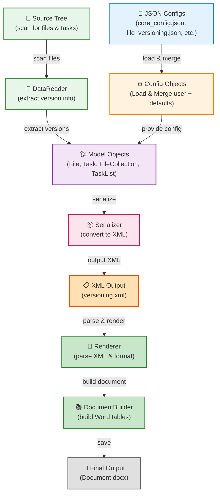

# VDD-Automation

Automated generation of **Version Difference Document (VDD)** reports in Word (`.docx`) format from XML versioning data.

Given a source tree and configuration files, VDD-A:
1. Scans source files and task configuration to extract version information.
2. Serialises the result into structured XML.
3. Renders the XML into a formatted Word document, ready for delivery.

---

## Project structure

```
VDD-A/
├── 📁 config/                      # User configuration (JSON)
│   ├── core_config.json
│   ├── file_versioning.json
│   └── task_versioning.json
├── 📁 src/                         # Source code
│   ├── 📁 configs/                 # Config loaders (user + default)
│   ├── 📁 data_reader/             # Source scanning
│   ├── 📁 document_builder/        # Word document builder
│   ├── 📁 model/                   # Domain model
│   ├── 📁 serializer/              # XML serialization
│   └── 📁 utils/                   # Logger, JSON parser
├── 📄 generate_docs.py             # Documentation generator (pdoc)
└── 📄 requirements.txt
```

---

## Requirements

- Python 3.12+
- Dependencies listed in `requirements.txt`

```bash
pip install -r requirements.txt
```

---

## Configuration

VDD-A uses a **two-level configuration system**:

1. **User Config** (JSON files in `config/`): What you customize per document
   - Paths, metadata, modes, regex patterns
   - Mutable — edit before each VDD generation

2. **Default Config** (Python dataclasses in `src/configs/default_config/`): Static structural constants
   - File extensions to scan, directories to skip, INI field names
   - Immutable — only changed by developers when rules need updating

The supported way to access configuration in code is through the feature-specific `Config` classes, such as `CoreConfig`, `FileVersioningConfig`, and `TaskVersioningConfig`. These classes act as the public interface for the project: they combine the user config and the default config and expose both through properties.

If you add a new chapter or another processing flow, follow the same pattern by creating a new `Config` child, a matching default config dataclass, and the related reader/generator/renderer classes when needed.

**👉 See [CONFIGURATION.md](CONFIGURATION.md) for the complete guide** with examples and design rationale.

### Quick Reference: User Config Files

**`config/core_config.json`** — Core document settings

```json
{
    "vdd_type": "vital",
    "kernel_mode": "internal",
    "paths": {
        "stream_root": "C:\\path\\to\\source",
        "output_dir": "C:\\path\\to\\output"
    },
    "metadata": {"doc_name": "VDD Document"}
}
```

**`config/file_versioning.json`** — Chapter 2 (file list)

```json
{
    "mode": "version",
    "version_extraction_criteria": "Versione:\\s*(\\d+\\.\\d+)",
    "metadata": {
        "title": "LIST OF WSPHS+ SW FILES AND RELEVANT VERSIONS",
        "columns_name": ["Name", "Version"]
    }
}
```

**`config/task_versioning.json`** — Chapter 3 (task list)

```json
{
    "previous_release": {
        "enabled": true,
        "root": "C:\\path\\to\\previous\\release"
    },
    "metadata": {
        "title": "TASK LIST",
        "columns_name": ["Name", "Type", "Version", "Modified"]
    },
    "app_tasks": ["ixl.ini", "srlw.ini"]
}
```

---

## Usage

### 1 — Generate the versioning XML

Run the appropriate parser to scan sources and produce the intermediate XML:

```bash
cd src
python file_versioning_test.py   # produces file_versioning.xml
python task_versioning_test_internal.py  # produces task_versioning_output.xml
```

### 2 — Build the Word document

```python
from configs import CoreConfig, FileVersioningConfig, TaskVersioningConfig
from document_builder import DocumentBuilder, FileVersioningRenderer
from document_builder.renderer.task_versioning.task_versioning_renderer import TaskVersioningRenderer

core_conf = CoreConfig("config/core_config.json")
fv_conf   = FileVersioningConfig("config/file_versioning.json", core_conf)
tv_conf   = TaskVersioningConfig("config/task_versioning.json", core_conf)

builder = DocumentBuilder(output_path="output/VDD.docx")
builder.add_section(FileVersioningRenderer("file_versioning.xml", fv_conf)) \
       .add_section(TaskVersioningRenderer("task_versioning_output.xml", tv_conf)) \
       .save()
```

See [`src/doc_builder_demo.py`](src/doc_builder_demo.py) for a complete runnable example.

---

## API documentation

Generated HTML documentation is available at:  
**https://claudiopisa.github.io/VDD-A/**

To regenerate it locally:

```bash
# Static HTML → docs/
python generate_docs.py

# Live preview in the browser
python generate_docs.py --live
```

---

## Architecture overview

**VDD-A follows a layered pipeline architecture:**


