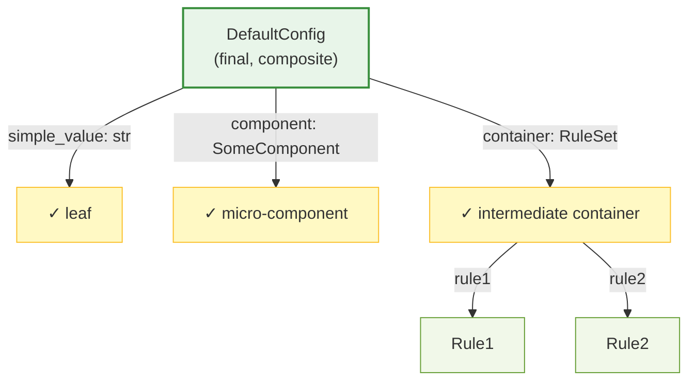
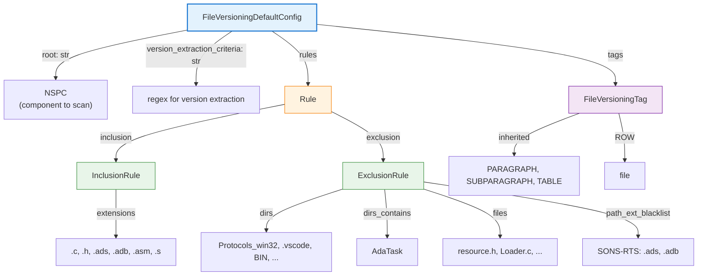

# Default Configuration Architecture

## Overview

The `default_config/` package defines **immutable, frozen dataclasses** that represent the structural defaults of the VDD-A system. These are NOT user-configurable values — they are compile-time constants that define:

- Core component identifiers (e.g., `"NSPC"`, `"NS_KERNEL"`)
- Scanning rules (which file extensions to include, which directories to exclude)
- XML/rendering tag names
- Parser-specific field mappings (e.g., "NomeTask", "V1_FileTask")

### Key Principle: Composition Over Inheritance

The default configs follow a **top-down hierarchical composition** pattern:



*Hierarchy: 3 levels deep, typically*

**Each class has one responsibility** — no duplicated logic, no redundant abstractions.

---

## Why Dataclasses + frozen=True

### Immutability is Required

```python
@dataclass(frozen=True)
class Tag:
    PARAGRAPH: str = "paragraph"
    SUBPARAGRAPH: str = "subparagraph"
    TABLE: str = "table"
```

**Why frozen?**

1. **Prevents Accidental Mutation**: The system relies on these constants never changing at runtime. Frozen dataclasses raise `FrozenInstanceError` if you try to modify them.
   
   ```python
   tags = Tag()
   tags.PARAGRAPH = "div"  # ❌ FrozenInstanceError: cannot assign to field 'PARAGRAPH'
   ```

2. **Enables Caching**: Frozen dataclasses can be used as dictionary keys or stored in sets (hashable).

3. **Thread-Safe**: Multiple threads can safely access frozen instances without locks.

4. **Clear Intent**: `frozen=True` signals to developers: "This is immutable by design."

### Dataclasses vs. Dicts / Namedtuples

<table>
  <thead>
    <tr>
      <th>Approach</th>
      <th>Pros</th>
      <th>Cons</th>
    </tr>
  </thead>
  <tbody>
    <tr>
      <td><strong>Dataclasses</strong></td>
      <td>Type hints, docstrings per field, <code>frozen=True</code>, <code>field()</code> defaults</td>
      <td>Slightly verbose</td>
    </tr>
    <tr>
      <td><strong>Dicts</strong></td>
      <td>Simple, flexible</td>
      <td>No type safety, no IDE autocomplete, prone to typos</td>
    </tr>
    <tr>
      <td><strong>Namedtuples</strong></td>
      <td>Immutable, hashable</td>
      <td>Less flexible, no dataclass features like <code>field()</code></td>
    </tr>
  </tbody>
</table>

**Verdict**: Dataclasses are the right choice for configuration constants.

---

## Structure: Core, File Versioning, Task Versioning

### 1. `CoreDefaultConfig` (core_default_config.py)

Shared constants used by **all** modules:

```python
@dataclass(frozen=True)
class CoreDefaultConfig:
    components: SoftwareComponents = field(default_factory=SoftwareComponents)
    serializer_config: SerializerConfig = field(default_factory=SerializerConfig)
    image_config_name: str = "Imgconf.ini"
```

**Components**:
- `SoftwareComponents`: Maps logical names to actual component identifiers (e.g., "SAFETY_NUCLEUS" → "NSPC")
- `SerializerConfig`: XML output settings (indentation, encoding, tag container)
- `Tag`: Base tag definitions (PARAGRAPH, SUBPARAGRAPH, TABLE)

### 2. `FileVersioningDefaultConfig` (file_versioning_default_config.py)

Defaults specific to file version scanning:



**Key insight**: The nested `Rule` container separates inclusion from exclusion, making the logic clear.

### 3. `TaskVersioningDefaultConfig` (task_versioning_default_config.py)

Defaults specific to task parsing (INI files, kernels, apps):

```mermaid
graph TD
    TV["TaskVersioningDefaultConfig"]
    TV -->|roots| ROOTS["Roots"]
    TV -->|sections| SECS["INISections"]
    TV -->|app_task| APPT["AppTask"]
    TV -->|sys_task| SYST["SysTask"]
    TV -->|num_tasks| NT["NumTask"]
    TV -->|rules| RULES["Rule"]
    TV -->|tags| TAGS["TaskVersioningTag"]
    
    ROOTS -->|internal| ROOTSINT["NSPC"]
    ROOTS -->|external| ROOTSEXT["ExternalRoots"]
    ROOTSEXT -->|app| ROOTSEXTAPP["NSPC"]
    ROOTSEXT -->|sys| ROOTSEXTSYS["NS_KERNEL"]
    
    SECS -->|SETTINGS| SEC1["Settings"]
    SECS -->|CONTAINER| SEC2["CONTAINER"]
    SECS -->|AP| SEC3["AP"]
    
    APPT -->|name| APT1["NomeTask"]
    APPT -->|path| APT2["V1_FileTask"]
    APPT -->|type| APT3["TipoTask"]
    APPT -->|version| APT4["RelTask"]
    
    SYST -->|BOOT| SYT1["FileBoot"]
    SYST -->|BOOT_AP| SYT2["FileBootAPs"]
    SYST -->|LOADER| SYT3["V1_FileLoader"]
    SYST -->|KERNEL| SYT4["V1_FileKernel"]
    SYST -->|KERNEL_VERSION| SYT5["RelKernel"]
    
    RULES -->|inclusion| INC["InclusionRule"]
    RULES -->|exclusion| EXC["ExclusionRule"]
    INC -->|internal| INC1["Imgconf.ini"]
    INC -->|external| INC2["ixl.ini, srlw.ini"]
    EXC -->|task_type| EXC1["NO_SCHED, RBC"]
    
    TAGS -->|inherited| TAGSBASE["PARAGRAPH, SUBPARAGRAPH, TABLE"]
    TAGS -->|ROW| TAGSROW["task"]
    
    style TV fill:#e3f2fd,stroke:#1976d2,stroke-width:2px
    style ROOTS fill:#fff3e0,stroke:#f57c00
    style SECS fill:#fff3e0,stroke:#f57c00
    style APPT fill:#f3e5f5,stroke:#7b1fa2
    style SYST fill:#f3e5f5,stroke:#7b1fa2
    style RULES fill:#e8f5e9,stroke:#388e3c
    style TAGS fill:#fce4ec,stroke:#c2185b
```



---

## Problem: Verbosity of Direct Access

### ❌ The Verbose Way (Direct Access)

If you access a default config directly, you quickly end up with deeply nested paths:

```python
from configs.default_config.file_versioning_default_config import FileVersioningDefaultConfig

default_config = FileVersioningDefaultConfig()

# Get the list of excluded directories
excluded_dirs = default_config.rules.exclusion.dirs
#                            └──┬──┘ └───┬────┘ └┬┘
#                         Level 1   Level 2   Level 3

# Get allowed file extensions
extensions = default_config.rules.inclusion.extensions
#                          └──┬──┘ └───┬────┘ └───┬────┘
#                       Level 1   Level 2      Level 3

# Get tag names for rendering
paragraph_tag = default_config.tags.PARAGRAPH
row_tag = default_config.tags.ROW
```

**Problems**:
1. Long accessor chains (hard to read)
2. Easy to make typos (IDE autocomplete helps, but still verbose)
3. Not all use-cases are obvious (do I need `rules.inclusion` or `rules.exclusion`?)
4. No semantic meaning in caller code

### ✅ The Elegant Way (Config Interface)

The `Config` subclasses (`FileVersioningConfig`, `TaskVersioningConfig`, `CoreConfig`) wrap the default configs and expose **flat, semantic properties**:

```python
from configs.file_versioning_config import FileVersioningConfig

config = FileVersioningConfig("config/file_versioning.json")

# Now all common accesses are simple properties:
excluded_dirs = config.excluded_dirs
extensions = config.allowed_extensions
paragraph_tag = config.paragraph_tag
row_tag = config.row_tag
```

**Under the hood**, these properties delegate to the nested structure:

```python
class FileVersioningConfig(Config):
    @property
    def excluded_dirs(self):
        return self.default_config.rules.exclusion.dirs
    
    @property
    def allowed_extensions(self):
        return self.default_config.rules.inclusion.extensions
    
    @property
    def paragraph_tag(self):
        return self.default_config.tags.PARAGRAPH
    
    @property
    def row_tag(self):
        return self.default_config.tags.ROW
```

**Benefits**:
1. **One-line access**: `config.excluded_dirs` instead of `config.default_config.rules.exclusion.dirs`
2. **Self-documenting**: `config.allowed_extensions` is clearer than nested paths
3. **Fewer typos**: IDE autocomplete shows all available properties
4. **Single point of maintenance**: If the internal structure changes, only the property needs updating

---

## Usage Patterns

### Pattern 1: Access via Config (Recommended)

```python
# When building a file versioning pipeline:
from configs.file_versioning_config import FileVersioningConfig

config = FileVersioningConfig(
    user_config_path="config/file_versioning.json",
    core_user_config_path="config/core_config.json"
)

# Use semantic properties
scanner = FileScanner(
    root=config.root,
    allowed_extensions=config.allowed_extensions,
    excluded_dirs=config.excluded_dirs,
    version_pattern=config.version_extraction_criteria,
)

# For rendering
renderer = FileVersioningRenderer(
    tags=config.tags,  # Simplified access
    paragraph_tag=config.paragraph_tag,  # Or use specific properties
)
```

### Pattern 2: Direct Access (Internal Only)

Use direct access only when:
- You're in the `Config` subclass itself (implementing the properties)
- You need the entire composite structure
- Testing edge cases

```python
# Inside FileVersioningConfig
@property
def excluded_dirs(self):
    # Direct access to default config (this is OK)
    return self.default_config.rules.exclusion.dirs
```

### Pattern 3: Testing

```python
# Test the default values directly
from configs.default_config.file_versioning_default_config import FileVersioningDefaultConfig

defaults = FileVersioningDefaultConfig()
assert "INCMAKE" in defaults.rules.exclusion.dirs
assert ".c" in defaults.rules.inclusion.extensions
assert defaults.tags.ROW == "file"
```

---

## Comparison: Verbosity Levels

### Task Versioning Example

**Via DefaultConfig (3 levels):**
```python
default_config = TaskVersioningDefaultConfig()
boot_field = default_config.sys_task.BOOT  # "FileBoot"
```

**Via Config (flat):**
```python
config = TaskVersioningConfig("config/task_versioning.json", "config/core_config.json")
boot_key = config.boot_key  # "FileBoot" (property handles the nesting)
```

**The same thing, 3 ways:**

<table>
  <thead>
    <tr>
      <th>Access Method</th>
      <th>Code</th>
      <th>Verbosity</th>
    </tr>
  </thead>
  <tbody>
    <tr>
      <td><strong>Direct DefaultConfig</strong></td>
      <td><code>default_config.sys_task.BOOT</code></td>
      <td>⭐⭐⭐ (high)</td>
    </tr>
    <tr>
      <td><strong>Via Config Property</strong></td>
      <td><code>config.boot_key</code></td>
      <td>⭐ (low)</td>
    </tr>
    <tr>
      <td><strong>Hardcoded String</strong></td>
      <td><code>"FileBoot"</code></td>
      <td>Dangerous!</td>
    </tr>
  </tbody>
</table>

---

## Design Rationale

### Why Nested Composition?

1. **Semantic Grouping**: All exclusion rules live in `ExclusionRule`, all inclusion in `InclusionRule`. This makes it impossible to confuse them.

2. **Single Responsibility**: Each class handles one concern:
   - `AppTask`: How to parse app tasks from INI
   - `SysTask`: How to parse system tasks from INI
   - `Rule`: Container for both
   - `TaskVersioningDefaultConfig`: The full picture

3. **Reusability**: `ExclusionRule` and `InclusionRule` appear in both file_versioning and task_versioning contexts, but with different semantics (reflected in their separate definitions).

4. **Type Safety**: Type hints at each level ensure you get what you expect.
   ```python
   rules: Rule = field(default_factory=Rule)  # Clear: this is a Rule, not a dict
   exclusion: ExclusionRule = field(...)      # Clear: this is specifically exclusion rules
   ```

### Why frozen=True?

These constants must never change at runtime. Frozen prevents bugs like:

```python
# ❌ This would be a silent bug without frozen:
config.default_config.rules.inclusion.extensions.append(".exe")
# Now ALL instances would have ".exe" (mutable list shared across clones!)

# ✅ With frozen=True, this immediately fails:
config.default_config.rules.inclusion.extensions.append(".exe")  # FrozenInstanceError
```

---

## Extending with a New Chapter

To add a new document type (e.g., "RiskAssessment"):

1. **Create RiskAssessmentDefaultConfig** in a new file:
   ```python
   @dataclass(frozen=True)
   class RiskAssessmentRule:
       # Define your rules
       pass

   @dataclass(frozen=True)
   class RiskAssessmentDefaultConfig:
       rules: RiskAssessmentRule = field(default_factory=RiskAssessmentRule)
       tags: RiskAssessmentTag = field(default_factory=RiskAssessmentTag)
   ```

2. **Create RiskAssessmentConfig** (public interface):
   ```python
   class RiskAssessmentConfig(Config):
       def __init__(self, user_config_path, core_user_config_path):
           self.user_config = self.load_user_config(user_config_path)
           self.default_config = self.load_default_config()  # Auto-discovers RiskAssessmentDefaultConfig
       
       @property
       def rules(self):
           return self.default_config.rules
   ```

3. **Clients use the flat interface:**
   ```python
   config = RiskAssessmentConfig("config/risk_assessment.json", "config/core_config.json")
   rules = config.rules  # Simple, no nesting
   ```

---

## Summary

<table>
  <thead>
    <tr>
      <th>Aspect</th>
      <th>Answer</th>
    </tr>
  </thead>
  <tbody>
    <tr>
      <td><strong>What?</strong></td>
      <td>Immutable dataclasses defining structural constants</td>
    </tr>
    <tr>
      <td><strong>Why dataclasses?</strong></td>
      <td>Type safety, frozen immutability, self-documenting</td>
    </tr>
    <tr>
      <td><strong>Why frozen?</strong></td>
      <td>Prevent runtime mutations, enable hashability, signal intent</td>
    </tr>
    <tr>
      <td><strong>Structure?</strong></td>
      <td>Hierarchical composition (3 levels typical): value → container → final config</td>
    </tr>
    <tr>
      <td><strong>Verbosity problem?</strong></td>
      <td>Direct access chains are nested; solved by Config interface properties</td>
    </tr>
    <tr>
      <td><strong>When use direct?</strong></td>
      <td>Internal to Config subclasses or testing; clients always use Config interface</td>
    </tr>
    <tr>
      <td><strong>Extensibility?</strong></td>
      <td>Add new DefaultConfig subclass + new Config public interface; DefaultConfigLoader auto-discovers</td>
    </tr>
  </tbody>
</table>

**Best Practice**: Always consume defaults via the `Config` subclass (e.g., `FileVersioningConfig`), never directly via `DefaultConfig` instances.
