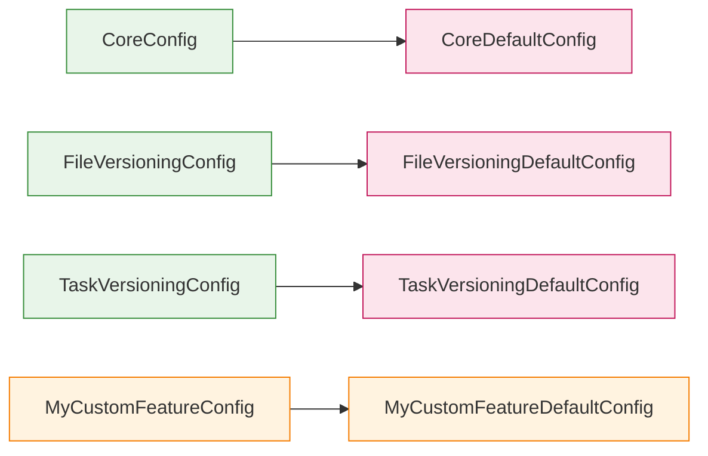
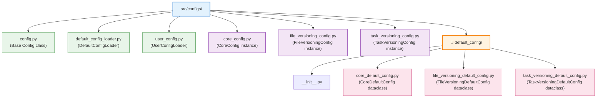

# DefaultConfigLoader — Technical Deep Dive

> **Architecture Guide**: [DEFAULT_CONFIG_ARCHITECTURE.md](DEFAULT_CONFIG_ARCHITECTURE.md) explains the overall structure, design rationale, and usage patterns of default configs.
>
> **Configuration Guide**: [CONFIGURATION.md](../../CONFIGURATION.md) for the complete guide on user vs default configuration.

This document explains the **technical internals** of how default configurations are automatically resolved and loaded.

---

## Overview

The `DefaultConfigLoader` class implements **automatic resolution** of default config classes based on naming conventions. This eliminates boilerplate imports and keeps code DRY.

In the current codebase, every `XyzConfig` class calls `Config.load_default_config()`, which delegates to `DefaultConfigLoader.load(self)` and returns the matching frozen dataclass instance.

### The Problem It Solves

Without automatic loading, creating a config would require:

```python
# ❌ Repetitive — must import both manually
from configs.file_versioning_config import FileVersioningConfig
from configs.default_config.file_versioning_default_config import FileVersioningDefaultConfig

config = FileVersioningConfig("config/file_versioning.json")
config.default_config = FileVersioningDefaultConfig()  # manual assignment
```

With `DefaultConfigLoader`:

```python
# ✓ Clean — default config is loaded automatically
config = FileVersioningConfig("config/file_versioning.json")
# config.default_config is already populated!
```

---

## Naming Convention

The loader uses a **predictable pattern** to resolve default configs:



**Algorithm**:
1. Get the config class name: `FileVersioningConfig`
2. Remove the `Config` suffix: `FileVersioning`
3. Convert to snake_case: `file_versioning`
4. Append `_default_config`: `file_versioning_default_config`
5. Import from: `configs.default_config.{module_name}` using the runtime import logic in `DefaultConfigLoader`
6. Instantiate the corresponding default config class

---

## How It's Used

### In the Config Base Class

```python
from .default_config import DefaultConfigLoader

class Config:
    def load_default_config(self):
        """
        Load the default configuration for this config class.
        Uses DefaultConfigLoader to auto-resolve the correct class.
        """
        return DefaultConfigLoader.load(self)
```

### In Concrete Config Classes

```python
class FileVersioningConfig(Config):
    def __init__(self, user_config_path: str | Path, core_user_config_path: str | Path | CoreConfig):
        self.user_config = self.load_user_config(user_config_path)
        # ↓ DefaultConfigLoader automatically resolves and loads FileVersioningDefaultConfig
        self.default_config = self.load_default_config()
```

---

## Adding a New Config Type

If you need to add a new feature with its own configuration:

### Step 1: Create the Config Class

`src/configs/my_feature_config.py`:

```python
from pathlib import Path
from .config import Config
from .core_config import CoreConfig

class MyFeatureConfig(Config):
    def __init__(self, user_config_path: str | Path, core_user_config_path: str | Path | CoreConfig):
        self.user_config = self.load_user_config(user_config_path)
        self.default_config = self.load_default_config()  # Auto-loads MyFeatureDefaultConfig
        
        if isinstance(core_user_config_path, CoreConfig):
            self.core = core_user_config_path
        else:
            self.core = CoreConfig(user_config_path=core_user_config_path)
    
    @property
    def some_setting(self):
        return self.user_config.some_setting
```

### Step 2: Create the Default Config

`src/configs/default_config/my_feature_default_config.py`:

```python
from dataclasses import dataclass, field
from typing import List

@dataclass(frozen=True)
class MyFeatureDefaultConfig:
    """Static defaults for MyFeature versioning."""
    setting_1: str = "default_value"
    setting_2: List[str] = field(default_factory=lambda: ["item1", "item2"])
    enabled: bool = True
```

### Step 3: Use It

```python
config = MyFeatureConfig(
    user_config_path="config/my_feature.json",
    core_user_config_path=core_config
)

print(config.user_config.some_setting)        # From JSON
print(config.default_config.setting_1)        # From dataclass
```

**That's it!** DefaultConfigLoader handles the rest automatically.

---

## Advanced: Manual Registration

If you need to break the naming convention (rare):

```python
from configs.default_config.default_config_loader import DefaultConfigLoader
from configs.default_config.special_default_config import SpecialDefaultConfig

# Register a custom mapping before instantiating the config
DefaultConfigLoader.register('MyCustomConfig', SpecialDefaultConfig)

# Now when you create MyCustomConfig, it will load SpecialDefaultConfig
config = MyCustomConfig("config/my_custom.json")
```

---

## Implementation Details

### DefaultConfigLoader.load()

```python
@classmethod
def load(cls, config_instance: Any) -> Any:
    config_class_name = config_instance.__class__.__name__
    
    # 1. Check manual registry first
    if config_class_name in cls._registry:
        default_config_class = cls._registry[config_class_name]
        return default_config_class()  # Instantiate and return
    
    # 2. Try automatic resolution
    return cls._auto_resolve(config_class_name)
```

### DefaultConfigLoader._auto_resolve()

```python
@classmethod
def _auto_resolve(cls, config_class_name: str) -> Any:
    if not config_class_name.endswith('Config'):
        raise ValueError(
            f"Config class '{config_class_name}' must end with 'Config'"
        )

    base_name = config_class_name[:-6]
    module_name = cls._camel_to_snake(base_name) + '_default_config'
    default_class_name = base_name + 'DefaultConfig'

    module = __import__(
        f'configs.default_config.{module_name}',
        fromlist=[default_class_name]
    )
    default_config_class = getattr(module, default_class_name)
    return default_config_class()
```

---

## Error Handling

### Missing Default Config Module

```python
# If FileVersioningDefaultConfig doesn't exist:
# ImportError: cannot import name 'FileVersioningDefaultConfig' from 'configs.default_config.file_versioning_default_config'
```

**Fix**: Create the missing module and class.

### Naming Convention Violation

```python
# If config class doesn't end with "Config":
# ValueError: Config class 'FileVersioning' must end with 'Config'
```

**Fix**: Rename to `FileVersioningConfig`.

---

## Benefits

<table>
  <thead>
    <tr>
      <th>Benefit</th>
      <th>Why It Matters</th>
    </tr>
  </thead>
  <tbody>
    <tr>
      <td><strong>No Boilerplate</strong></td>
      <td>Add new features without import bloat</td>
    </tr>
    <tr>
      <td><strong>Convention Over Configuration</strong></td>
      <td>One naming pattern, automatic resolution</td>
    </tr>
    <tr>
      <td><strong>Type Safety</strong></td>
      <td>Immutable dataclasses prevent configuration mistakes</td>
    </tr>
    <tr>
      <td><strong>Maintainability</strong></td>
      <td>New default configs don't require loader changes</td>
    </tr>
    <tr>
      <td><strong>Clarity</strong></td>
      <td>Naming convention makes relationships obvious at a glance</td>
    </tr>
    <tr>
      <td><strong>Extensibility</strong></td>
      <td>Manual registry allows exceptions when needed</td>
    </tr>
  </tbody>
</table>

---

## File Structure



---

## Requirements

- **Python 3.12+** (uses `str | Path` union syntax)
- Config classes must follow the naming convention: `XyzConfig`
- Default config classes must follow the naming convention: `XyzDefaultConfig`
- Default config modules must exist in `configs/default_config/`
- Default config classes must be immutable (`@dataclass(frozen=True)`)
